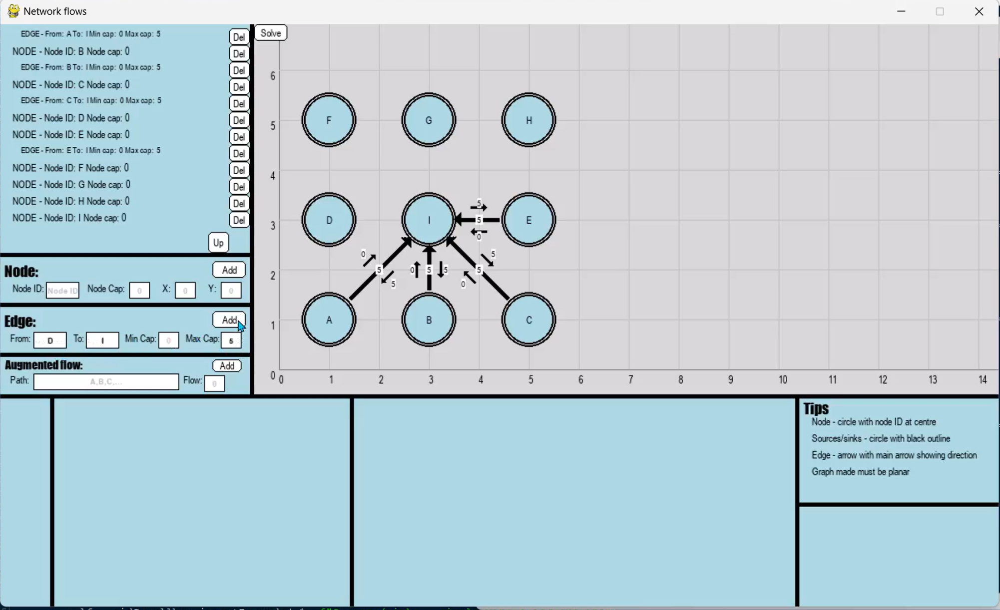
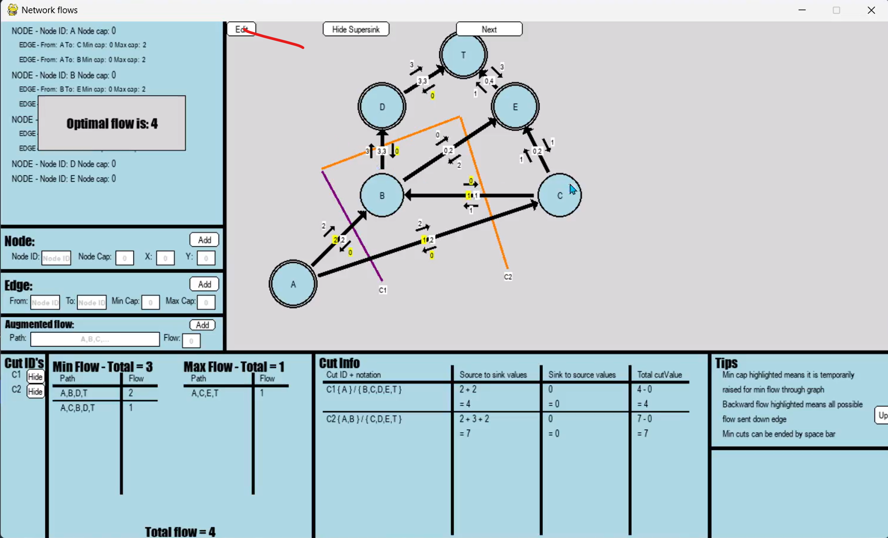

# Project: A learning resource for Maximum flow minimum cut theorem within the further maths AQA curriculum in python

## Description 
The maximum flow and minimum cut theorem can be a challenging topic due to multi-path and multi-cuts to analyse and find. The project provided an interactive teaching tool that allows a more versatile approach to building and solving problems within the context of maximum flow minimum cut theorem, giving appropriate solutions, enabling benefits both from a teaching perspective and as a student resource.

From doing further maths myself, i found little resources online for maximum flow minimum cut theorem, most of which were powerpoints, therefore the project was made to supplement these and allow the creation of a greater problem set which each graph having a step by step approach to not only aid understanding but verify your solutions. 

#### The project creates an interactive GUI where the user can:  

- Build a directed graph with initial states (sources) and finishing states (sinks) using a custom GUI with Pygame.  
- Determine the maximum flow that could be sent through the graph at any one time, obeying the capacities of each edge. 
- Enable the user to draw their own cuts on the graph and display analysis depending on collisions between edges.  
- Handle edges with a minimum capacity that must be sent through the graph.  
- Add supersources and supersinks as a visual aid for multiple sources and sinks, dynamically positioning them without collision and allocating associated edges.  
- Include node capacities to show that a node can have a limiting capacity within itself, not just its edges.  
- Evaluate the maximum flow as the lower bound and compare this with the minimum cut as the upper bound to find the optimal flow.  

#### Other key features  
 
- Allows the user to hide and show supersources/supersinks/node capacities and cuts to enable a more specific focus on certain elements of the graph.  
- Creates a double outlined node to identify sources/sinks/supersources and supersinks.  
- Creates a custom GUI which included:
    - A scrollbar with ability to display results over a single row or multiple using dynamical underlining on each record independent of the number of rows it holds.
    - Textboxes with sanitisation to filter the inputs to allow strings, integers and floats.
    - Buttons which either have a single purpose or become multi-phase.  
- Collision detection algorithms to check for collisions between nodes and edges.  
- Built the algorithm for maximum flow and minimum cut aspects of the solution from scratch, in particular using the intersection between a cut and edge to determine invalid cuts and the side at which the node lies (either the source or sink side). The maximum flows was also revealed in a step by step manner, allowing greater focus on each individual path. 
- Use multi coloured cuts as well as highlighting the back flow when 0, enabling a focus on a specific part.  
**For a more detailed explanation of the project, see the write up folder** [here](/NEA%20A-level/Write%20Up)

## How to use the project? 
This projects acts as a tool to create and validate your answers for each graph made. This can be run through the NetworkFlows10.py file if pygame is installed within the IDE.
If this is not installed, this below code should work on windows and linux depending on your configurations:  
`pip install pygame`

## Specific technologies

The pygame framework was used over others such as Tkinter due to the real time user interaction when drawing cuts. Although this means the screen will refresh constantly, however this enables the user to experiment with a range of cuts to further increase there understanding.  
Although tkinter has more accessible GUI features such as scrollbar unlike pygame, resulting a custom GUI interface, this meant i could configure buttons and scrollbars to a specific use case, allowing greater versatility.

## Challenges and future features

- Maintaining and debugging ==> As this was my first project with such a large code base, testing was initially done at the end of a segment of coding, which could be fairly time consuming. This was solved by both using a debugger through vscode as well as testing each function in isolation before testing the function as part of the system. 

- Collisions ==> Although pygame has inbuilt collision detection for images, due to image boxes of the egdes covering a much greater area that the shown edges as well as the rotation and scaling, this meant detection had to be custom built for 4 scenarios:
    1. New node colliding with existing node
    2. New node colliding with existing edge
    3. New edge colliding with existing node
    4. New edge colliding with existing edge  

In future updates, a cache generator may be used to further improve performance at collision detection or the images could be replaced with shapes (e.g rectangles) to utilise the inbuilt collision detection within the pygame framework.

Other future features include:  
- Being able to highlight a path as it is being added to the scrollbar in the bottom left as well as once the path has been displayed, changing the colours. This would enable a greater isolation of certain parts of the graph, which coupled with a similiar idea for individual edges, may allow a greater clarity when working on larger graphs.
- Enable the ability to load and save data using a database to enable quicker set-up of graphs, allowing greater time efficiency. This would probably be implemented using sqlite3 using a normalised relational database.

## What did you learn

1. Importance of scalability and versatility within the design
2. Importance of user preferences, improving my communication with clients particularly in regards to the user interface elements
3. Managing and debugging on a larger codebase
4. Deepened own knowledge on a range of data structures algorithms such as queues and DFS, concepts of OOP and the pygame framework. 

  

Does this focus on main features of the project?