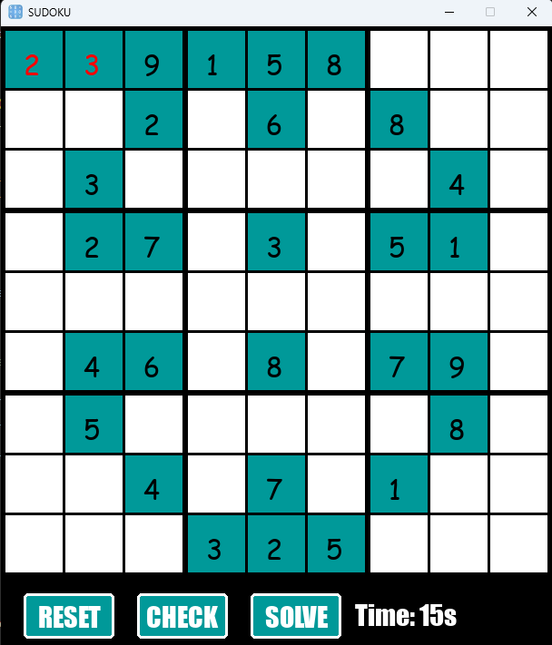

# Project: Sudoku using a GUI

## Description

From doing a project Euler challenge of finding solutions to sudoku, this inspired an interactive GUI where the user can solve the sudoku, competing for the fasterst time. This uses the partially completed sudoku from [problem 96](https://projecteuler.net/problem=96). The project had the following features:
- Utilised a mutil phase approach through OOP to enable three phases:
    - Phase 1: enter the players name
    - Phase 2: view and solve the sudoku 
    - Phase 3: displays the leaderboard once the problem has been solved
- Uses a backtracking algorithm to solve the sudoku and uses this to compare with the user's inputs, identifying mistakes 
- Enables sanitisation and validation of input by only allowing numbers for the solving of the sudoku and any unicode character for the player's name
- Can complete an autosolve displaying the solved sudoku to the user 
- Displays a leaderboard utilising a sqlite database to store and track the time taking to solve 
- Custom user interface including buttons and text boxes

The project can be found by running `py Main.py`.

## Specific technologies
This project uses 3 core libaries:
- pygame which enables an interactive GUI, chosen due to its high refresh rate resulting 
- deepcopy to allow the sudoko variable to make a copy at a different memory address rather than a shallow copy, to prevent independant variables changing at the same time
- sqlite3 for direct read and write from the relational data base

## Challenge and future features
When building this project there was a couple of challenges.
1. Shallow copying - when copying a 2D list, rather than copying the values of the data structure to a seperate memory location, this used a pointer to direct it to the same memory location, resulting in both variables being updated rather than just one.  This was solved by using the copy.deepcopy function to force the new memory allocation.
2. Generating sudoku - when generating valid grid it was hard to determine if there was a single solution or multiple depending on the inital information provided, therefore used predetermined grid. Generation of sudoko's is a future feature. 
3. GUI - when designing buttons, textboxes and design of the phases, i initially found it hard to find a design that was user friendly. However, by sending forms, this enabled a more structured approach similiar to as if i had a client.

Although this project acts as a tool for solving sudoku, this could, if it is displayed the backtracking algorithm to the user, be a tool used for understanding recursion.

## What did i learn
1. The importance of communication with clients - enables a focus of the user interface and design, allowing a more simplistic GUI that is more accessible.
2. Databases - using sqlite3 to create a relational database, although the database was a single table, this taught me through research about normalisation as well as the framework, utilising SQL queries where appropiate.
3. Pygame - through this having a multi-phase approach to the project, this taught me the ability to segment the game into procedures, highlighting the importance of dynamic object generation especially due to the 91 inputboxes for the sudoko grid.

    

